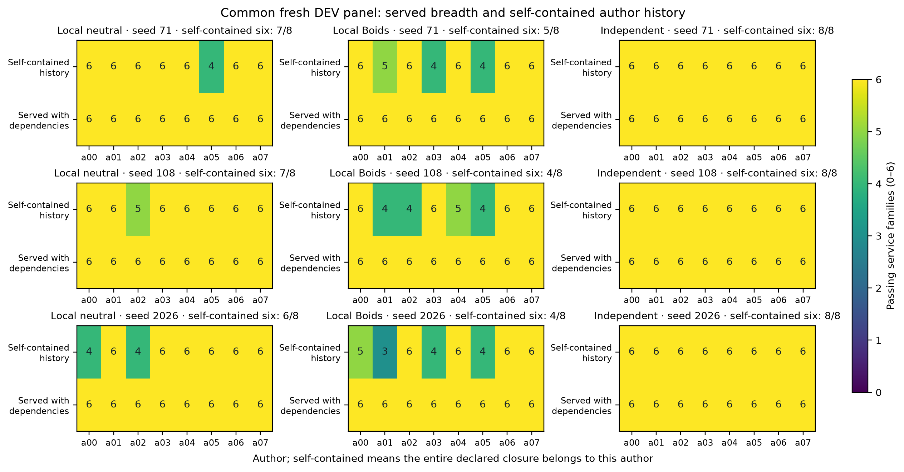

# Boids 工具生态：三种子的最终机制结果

日期：2026-10-09。九个预定社会及全部冻结审计已完成；付费实验结束。这是一个**恢复后探索性机制实验**，不是外部 benchmark 排行榜，也不是原来 SAC 研究的 confirmatory 结果。

**本轮发现：局部 Boids 提示对应更多实际工具采用、更多依赖邻居补齐服务的作者，但没有形成经验证的持续互补分工，也没有增加六类服务的群体覆盖。** 它更像改变了“谁自行维护完整工具库、谁使用邻居工具”的依赖模式。

用直白的话说：八个人都能做数据工具箱，Boids 提示让一些人更愿意借别人好用的工具。这种借用确实发生、并且能影响结果。但每个社会已经有人靠自己的历史工具箱覆盖全部六类需求，所以这批任务还没有证明为什么必须由多人分工才能完成。

## 设计与代码保证

8个无预分配角色的 agent，6轮，种子71/108/2026；三种条件是同一局部拓扑下的中性提示、Boids S/A/C 提示，以及只看自己历史、最后合库的独立生成。模型为 AgentPort 的 GPT-6-Luna，mini-SWE-agent 执行；每 agent 每轮最多6次调用、每次最多3000输出 tokens、4个并发。六类服务有真实的新列依赖：清洗、收入、分组、月份汇总、目标比值、滚动均值。

每轮先固定全部视图，再执行；所有会话结束后才发布、评分和传递。私人工作区持续存在，原生 Python 包及声明依赖以不可变版本传给下一轮邻居。主机每类用6个新 DEV 案例验证，模型看不到私有输入或参考实现。adapter 只是验证接口，不限制内部工具 API。

代码保证预算、版本/可见性、输入不变性检查、有限案例正确性和可观测 Python 调用归因。它**不保证**角色一定出现、模型理解邻居代码、形式化程序正确性或群体性能优于单 agent。S/A/C 是方向性 prompt 提示，不是原始 Boids 的连续位置/速度方程。

## 全部九单元结果

| 种子 | 条件 | 发布 / 48次机会 | 六类全过发布 | 正确跨作者案例请求 | 持续单类通过 | 模型请求 |
|---|---|---:|---:|---:|---:|---:|
| 71 | 局部中性 | 47 | 31 | 144 | 0 | 237 |
| 71 | 局部 Boids | 46 | 36 | 600 | 0 | 222 |
| 71 | 独立生成 | 48 | 38 | 0 | 0 | 230 |
| 108 | 局部中性 | 47 | 30 | 324 | 0 | 225 |
| 108 | 局部 Boids | 45 | 35 | 720 | 0 | 224 |
| 108 | 独立生成 | 47 | 38 | 0 | 0 | 236 |
| 2026 | 局部中性 | 46 | 38 | 468 | 0 | 234 |
| 2026 | 局部 Boids | 48 | 32 | 612 | 0 | 215 |
| 2026 | 独立生成 | 46 | 39 | 0 | 0 | 229 |

“六类全过发布”是通才化和程序可靠性的描述，**不是分工质量总分**。成功只提供一类的发布按定义不会进入这一列；不能直接据此说 Boids 的分工更差。整体覆盖、自足能力、持续贡献和实际功能依赖必须另外看。三个种子中的独立组都有更多完整通才发布，但这也不等于已经完成单-agent/集中式成本优势比较。

三个种子中 Boids 的正确跨作者案例请求都更多：合计1,932，中性936。剔除空表后分别为1,607和780。请求是重复测试案例，不是独立协作事件、独立社会或全部经干预证明的必要贡献。所有社会最终的累计服务覆盖均为六类、作者服务集合 Jaccard 均为1.0；该服务覆盖允许依赖邻居。

[完整逐版本 CSV](../../studies/tool_ecology/evidence/v031/collection-01/results.csv) · [非空请求及窄发布审计](../../studies/tool_ecology/evidence/v031/collection-01/request-execution-audit.json)

## 复用改变了什么，没改变什么

冻结后把420份发布全部放到同一新 DEV 面板（seed31415926、round99）重测。沿声明依赖剔除所有需要其他作者的包，得到作者的**自足历史工具库**。能自足覆盖全部六类的作者数如下：

| 种子 | 中性 | Boids | 独立 |
|---|---:|---:|---:|
| 71 | 7/8 | 5/8 | 8/8 |
| 108 | 7/8 | 4/8 | 8/8 |
| 2026 | 6/8 | 4/8 | 8/8 |

Boids 社会里更多作者通过外部依赖补齐服务。这支持已发布工具的依赖模式存在差异，不能把它直接叫作互补专业分工、原创性或独立理解。

九个社会的共同面板群体覆盖均为6/6，最佳作者的自足历史库覆盖也均为6/6，群体相对最佳自足作者的覆盖增量全部为0。逐一移除任一作者及所有直接、间接依赖它的包，72次结构移除的服务类别损失均为0。这是现有依赖图的结构诊断，没有模拟 agent 移除后的适应。历史库覆盖是多个历史版本的并集，不等于当前一个包的能力。

[共同面板全部结果](../../studies/tool_ecology/evidence/v031/collection-01/fresh-panel/summary.json) · [轨迹图](../../studies/tool_ecology/evidence/v031/collection-01/figures/ecology-trajectories.svg) · [全部九组执行图](../../studies/tool_ecology/evidence/v031/collection-01/execution-graphs)

## 不是完全没有窄化：一次短暂轨迹

420份有效发布中，416份声明六类，4份只声明 lookup；首轮72份发布全部声明六类。四份窄发布都在 seed2026 Boids，三份 lookup 完全通过，一份只过1/6。预设的“连续至少三轮、同一作者仅一类完整通过”指标为0；它是严格的、受程序正确性影响的代理指标，不能覆盖所有可能的分工形式。

其中 a00 第2轮借用邻居的 lookup，6/6；第3轮继续委托，6/6；第4轮自行重写 lookup，1/6；第5、6轮回到六类整包复用。a01 也只在第2轮窄化一次。窄接口来自通才邻居的函数选择，尚未证明是不可替代的独立专长。

后验隔离诊断发现，a00_r04 算出了标准化 region，却没有把它写回输出行。只补一行 `row['region'] = region`，同一面板从1/6变成6/6，且没有崩溃或输入修改。原包、原分数和原冻结库完全不改。这解释一份生成程序的失败，不证明 Boids 导致该 bug，也不能把人工修复后的三轮持续性算进原实验。

[隔离问题与结果](../../studies/tool_ecology/evidence/v031/collection-01/narrow-lookup-diagnosis/summary.json) · [一行差异](../../studies/tool_ecology/evidence/v031/collection-01/narrow-lookup-diagnosis/one-line-fix.diff)

## 证据强度与失败分类

420份发布去掉追踪后重放，服务成绩全部一致。每个局部社会按事先规定顺序干预前12条符合条件的边，共72条；71条有“实际命中、无崩溃/输入修改、原正确案例丢失正确性”的见证。一条未确认：对应 helper 唯一正确案例是空表，保持形状的返回扰动无法改变空列表。修改已经错误的案例不能提供正确性丢失证据。保留这个未确认结果，不另挑边替换。

[重放与干预汇总](../../studies/tool_ecology/evidence/v031/collection-01/diagnostics.json) · [未确认边解释](../../studies/tool_ecology/evidence/v031/collection-01/unconfirmed-intervention.json)

原 v0.3 的 re-export 漏计是基础设施 bug，错误反馈污染的 batch01 已作废且未混入本集合；传输超时也不是 Boids 或模型的语义失败。生成程序不符合服务契约，以及本设置下没有经验证的互补覆盖，是分别记录的实际结果。

有效发布共15,000个声明服务案例，862个失败，均为字段/数值差异；其中833个仅 region 列不同，其余包括 revenue、units。字段差异是描述，不自动说明所有程序同因，更不能归因于局部规则。上面的单行隔离修复只建立该程序的局部原因。432次机会还有3次发布契约拒收和9次 skip，均保留。

[失败输出字段审计](../../studies/tool_ecology/evidence/v031/collection-01/output-differences.json)

## 来源、成本与局限

原修正 batch02 在55秒等待下完成五个社会后发生一次 API 超时，始终保留 ABORTED。四个缺失单元从全新目录补跑，等待180秒、SDK重试0，模型/提示/任务/grader不变。原五单元版本376966b；恢复的 seed108中性ff35881、seed2026独立fb3e8e2、中性e0199e1、Boids6e0daf1。九单元另建 `demand-collection-01`，逐单元披露完整版本与哈希。没有把补跑写回原中止批次，没有从测量作废批次取单元。

只读审计核对90个生成源码/参考 Git blob、九组原始与集合冻结库、请求设置与服务商返回模型。成功响应全部为 gpt-6-luna；SDK 重试为0，客户端没有模型替换。原始 API 数据保留主机，不公开。

| 有效社会条件（三种子合计） | 请求 | 输入 tokens | 输出 tokens | 缓存输入 tokens |
|---|---:|---:|---:|---:|
| 局部中性 | 696 | 3,466,964 | 213,861 | 2,576,854 |
| 局部 Boids | 661 | 3,317,264 | 205,653 | 2,399,887 |
| 独立生成 | 695 | 2,470,848 | 206,737 | 1,803,280 |

有效九单元共2,052次请求，另有中止部分69次；总2,121低于原2,592上限。已知输入9,480,041、输出653,107、缓存输入6,941,263 tokens；一次超时的服务商用量和账单未知。缓存输入是输入的子集。未核实货币定价，runtime cost=0 不代表免费。此前工程107次、测量作废主批次581次也单独保留；这一 repeated-demand 流程归档尝试合计2,809次，不把作废消耗隐去。

[所有尝试成本](../../studies/tool_ecology/evidence/v031/collection-01/usage-accounting.json) · [生成与 API 元数据审计](../../studies/tool_ecology/evidence/v031/collection-01/provenance-audit.json) · [逐单元来源](../../studies/tool_ecology/evidence/v031/collection-01/COLLECTION.json)

每条件只有三个社会；恢复等待与完成选择、有限 DEV 案例、六轮短期过程、同质模型、不可完整观测的 native/反射/生成器调用，都限制结论。种子控制拓扑和数据，不保证模型生成确定。没有持续单-agent或集中分工的付费对照，不能宣称 Boids 胜过它们。

这批任务允许一个作者的自足历史库覆盖全部需求，覆盖指标很快饱和；任务对通才太便宜、缺乏必须分工的压力，是与结果一致的设计解释，尚未经过难度/资源干预证明。因此本轮能支持“局部提示下的工具采用与依赖组织差异”，不能支持“Boids 已产生必要的互补协作”。下一项研究若要验证后者，应先使共同需求超出单个作者可维持的能力，并补单-agent/集中式对照；本轮不追加付费去追求有利分数。

最终本地原生工具与分析测试64项通过（真实 Docker，31.03秒），Ruff通过。生成与审计代码版本的两项原生 Linux CI 及原核心 DEV Linux CI均已通过；公开文件另外检查密钥与冻结哈希。所有预定生成、冻结重放、干预、共同面板、来源/输出审计及图均已完成。原始失败与后验诊断分开保存；付费结束，自动跟进在发布完成后暂停。
