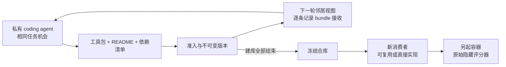

# 三步交付与 GPT-6-Luna 工程 pilot

三步已完成：选定 benchmark、实现成熟 coding-agent 驱动的局部建库系统、冻结后用新消费者评测，并实际运行 GPT-6-Luna。

结果是：**工程链路成立；有一个可验证的跨作者工具组合；稳定互补分工和解题收益尚未成立。** 有工具库的四份正式解题提交均未导入发布包，也没有观察到库函数执行；阅读目录/文档带来的信息影响仍不能排除。这轮应称为工程 pilot。

有效运行：`luna-smoke-07`，生成/评分代码 **c7e22a6**，4 agents × 3 rounds × 2 个建库组，另有无工具库消费者。执行与原始数据位于 [本地运行目录](/Users/wangxiang/.local/share/boids-ecology-workspace/runs/luna-smoke-07)，源文件与模型请求均有记录。

## 1. Benchmark 选择

审阅 pyda（21 个下游问题）、python_validation（14 个）、uglypie（11 个）的公开设计规格、依赖和任务目录。选择 LibraryDesignBench 的 pyda：数据读取、分组、连接、时间与窗口操作有组合空间，也最接近原来的工具系统。验证库 schema/元类约束、可变 HTML 树的系统耦合留作后续域。

暂不以 ProgramBench 作为主实验：完整程序重建的总成绩很难直接揭示工具媒介下的分工机制。本次是 LDB 的受控改编，不是官方 leaderboard 提交。排除设计中已公开的 overlapping-logs、customer-merge，在模型运行前固定 weather-features 和 scorer-lineage 两题。原始参考程序已通过 19/19 与 14/14；题目不被建库 agent 看见。“隐藏”只指本次运行中不提供，不声称不存在预训练污染。

## 2. 已实现的系统

底层使用未修改的 mini-SWE-agent 2.4.6 DefaultAgent，模型为 AgentPort 返回的 GPT-6-Luna。自写部分是实验控制、包登记、邻居视图、API 预算记录和评测隔离。

四个 agent × 三轮；各 agent 有持续私有文件，每轮对话重新开始。所有人得到同一个公开 library spec 和相同的当轮需求机会，没有预设专家。每次最多六次模型调用，可读写代码和执行测试。固定随机环，每个 agent 有两个邻居。中性组与 Boids 组获得相同局部证据，Boids 组额外获得 S/A/C 方向提示。这是 prompt 层面的 Boids-inspired intervention。

工具是任意原生 Python API 的不可变包，附 README 与依赖清单；按轮次屏障交给邻居，显式声明的传递依赖随包传播并逐条记收据。最后合并冻结，另起全新的消费者，每题最多十二次模型调用，可以调用工具、写适配层或直接解题。第三组仅运行没有工具库的消费者。

## 3. 代码保证与边界

保证：私有目录；下一轮才能看见邻居发布；固定包 ID；拒绝普通静态 import 的未声明依赖和越界相对导入；发布/提交拒绝 symlink 与特殊文件，反馈原子替换；冻结前后逐字节校验；离线 Docker、无 API 凭据/宿主 Docker socket；模型退出后才在另一容器引入原始评分器；缺失/空评分文件与超时作为 infra failure；原始失败保留，无自动模型 fallback/transport retry。

不保证：动态/反射 import 没有完整静态证明；准入仅检查语法/协议，不证明工具语义正确；标签和 import 不是稳定分工；函数追踪不覆盖全部类方法、native/reflection；执行到工具不等于工具有净收益；源代码复制或阅读文档可能传递信息而不形成 import 边。

最终 23 项回归测试实际验证真实 mini-SWE 修改→测试失败→修复→提交；实际检查 /opt/venv、pyarrow 和 numpy；跨作者 fixture 的非崩溃返回值干预；symlink 拒绝、依赖快照、冻结防篡改、评分错误分类及真实超时容器清理。

## 4. 有效结果

| 组别 | weather-features | scorer-lineage | 整题全通过 | 原始 LDB 综合分（天气 / 评分） |
|---|---:|---:|---:|---:|
| 局部中性 | 19/19 | 14/14 | 2/2 | 0.8764 / 0.4141 |
| 局部 Boids | 9/19 | 14/14 | 1/2 | 0.2048 / 0.3946 |
| 无工具库消费者 | 19/19 | 11/14 | 1/2 | 0.8354 / 0.2378 |

LDB 分保留原始 verifier 的正确性与代码简洁性综合计分，未自创奖励。六份冻结提交在关闭追踪插桩后全部重放，通过数和综合分逐项一致。[机器可读表格](evidence/pilot-07/results.csv) / [完整分析](evidence/pilot-07/analysis.json)。

| 建库观察 | 局部中性 | 局部 Boids |
|---|---:|---:|
| 接收的不可变包 | 12/12 | 12/12 |
| 用完六次调用预算的建库过程 | 3/12 | 3/12 |
| 声明依赖边：自有 / 跨作者 | 3 / 0 | 4 / 1 |
| 冻结后原生 import 检查 | 12/12 | 12/12 |
| 正式下游提交导入发布包 | 0/2 | 0/2 |

所有快照均与接收账本一致；三个冻结库的哈希通过复核。import 成功不代表各功能正确。

### 直接查明的原因

**Boids 组天气题的 9/19 是消费者代码失败。** 映射表使用 `csv`、`parquet` 等键，`os.path.splitext` 却返回 `.csv`、`.parquet`，所以合法输入也被拒绝。轨迹显示它确认 pyarrow 可用，随后在修复 schema 与异常日志时反复遇到错误，最终用尽十二次调用，退出状态为 LimitsExceeded。九个通过项全部是拒绝无效输入测试，不能解读为实现了 47% 的任务功能。

仅在单独副本中把映射键补上点号，原始 verifier 从 9/19 变为 18/19；剩下一项是遗漏输入列校验。这个单处干预支持故障定位，[修改与结果](evidence/pilot-07/posthoc-weather.diff) 单独保存，**正式分数仍是 9/19**。程序没有调用发布工具，因此该代码错误不是 Boids 机制导致的证据。

**无工具库评分题的 11/14 涉及时间序列化。** 三个失败 diff 的关键是 `...00.000000Z` 与 `...00Z` 不一致。书面契约要求 UTC ISO 与 Z，未明确零小数位的规范；严格 grader 将其判错。原始分数保持不变，但不能把这个结果描述为整个事件评分/重放逻辑失败。这也说明需要按失败类型解释 benchmark，而不是只报一个比例。

**Boids 的唯一跨作者边确实提供了功能，也继承了缺口。** a03_r03 的流式汇总层依赖邻居 a00_r01 的读取器。对固定小 CSV 的人工诊断调用得到正确的分组 sum/mean/count，并实际记录到跨作者调用。对上游转换函数做已记录的返回值干预后，进程仍正常退出，汇总值却改变。这验证了这条具体依赖的功能性，[见探针记录](evidence/pilot-07/cross-author-witness.json)。它是人工编写的运行后诊断，不冒充自主消费者的成绩或稳定分工。

同一组合读取 Parquet 时因上游需要 pandas 而失败；当前固定环境只有 pyarrow，没有 pandas。上游 README 声明了这个 optional dependency，语法和 import 检查却不足以揭示调用时的可用覆盖。下游继承了该限制。这是工具能力/依赖验证的问题，不能据此宣称所有工具均可用，也不能将它与已修复的 shell PATH 错误混为一谈。

### 真实消耗

| 组别 | 建库模型请求 | 消费者模型请求 | 总输入 tokens | 总输出 tokens |
|---|---:|---:|---:|---:|
| 局部中性 | 65 | 14 | 299,022 | 44,265 |
| 局部 Boids | 64 | 19 | 334,653 | 42,098 |
| 无工具库消费者 | 0 | 17 | 55,472 | 6,133 |

有效运行合计 **179 个物理模型请求，689,147 输入 / 92,496 输出 tokens，其中 489,018 输入 tokens 被提供商标为缓存命中；零传输错误**。金额未核实，运行日志中的 cost=0 是未定价元数据，不表示免费。无工具库组没有承担建库成本，因此它不是同总预算的持续单 agent 对照。

连同无效 smoke-03、smoke-02 的三个请求及一次路由探针，本次工程调试合计 348 个模型请求（含一次失败）；有 usage 的响应合计 1,320,841 输入 / 176,741 输出 tokens。失败响应没有 usage，不推测其 token 或费用。

一轮建库是最多六次模型调用的编辑/测试过程；消费者每题最多十二次模型调用。“9/19”指同一份提交通过十九个原始测试中的九个，不是十九个独立任务。整题成功要求该题全部测试通过。本轮每组只有两题、一个生成重复，拓扑 seed 不等于固定模型随机性，因此不计算显著性或泛化胜率。

直接使用库函数仅说明执行到了工具，不等于净收益；消费者复用一个作者的工具，也不证明建库群体形成了互补分工。跨作者声明依赖、跨作者执行依赖和有价值的因果贡献需要分别测量。

## 5. 必须保留的无效轮与 infra 修复

smoke-01：启动检查，零 API。smoke-02：第三个物理请求因 Azure Responses reasoning replay 的 status 字段被拒，两个成功响应和失败请求保留；修复字段归一化。smoke-03：165 个请求，完成全部单元，但 bash -lc 重置 PATH，agent 用系统 Python 看不到 pyarrow，grader 却使用正确 venv；不得用于组织方式比较。修复为 bash -c，并补真实依赖回归。smoke-04/05：iCloud 占位文件阻塞启动，零请求。smoke-06：Docker tag inspect 失败，零请求；改用同一已固定 image digest。执行副本与 sparse task checkout 已迁到 iCloud 外。

实际完成的是 smoke-07，生成/评分 code c7e22a6；Docker sha256:7e37d56580e826dd1ce4b9cb64bd07b333bf75f2ebfccf9c81622d257782c990；任务 a1f4e886063373d43e52b53b98492cf108f294e3。

运行结束后另外修复了 Docker 本地 tag 查询不一致：先解析唯一完整 image ID，再核对 inspect，拒绝缺失/歧义；不改变本轮生成或评分行为。最终代码回归 **23/23 通过**，Ruff 检查通过。首次人工功能探针有宿主脚本换行转义错误，零模型调用，失败记录保留；修正脚本后才得到上述功能探针结果。

## 6. 能说与不能说

当前是工程 pilot，不是稳定分工主实验。公开需求菜单不等于持续真实任务压力；没有正式测量每个作者经验证的能力轨迹。还缺多随机种子、持续单 agent/独立合库/集中分工的同总预算对照、全部未见任务与预先定义的重复需求条件。

这两道 pilot 题从现在起属于开发/诊断集。若做主实验，应另外锁定剩余十七题（21 减去 2 个设计可见例题和这 2 道 pilot 题），并保留公开 benchmark 的污染限制。本次原生 Python 消费者和依赖 bundle 是 v0.2 协议，不能直接与旧的受限 JSON 消费者或 DeepSeek pilot 比分。

下一阶段应保持工具接口开放，加入持续实际需求和可见开发测试，而不是强制消费者调用库或预分工；将成功率、代码简洁度、构建成本、消费者成本、可靠复用与能力持久性分别报告。若没有出现有价值的分工，应作为负结果分析，而不是调题让 Boids 赢。

## 对 Boids 迁移的工作假说

鸟群的位置/速度是直接可比较的局部状态；工具的“能力”“相似”“可兼容”却需要语义验证。当前规则读取的是作者描述、近期活动与源码，不是可靠的能力测量。因此：避免重复可能提前减少独立备选；对齐未验证接口可能传递缺陷；靠拢邻居的活跃方向也可能让大家覆盖相似功能。另一个可能原因是读取、理解、适配陌生 API 的成本高于 Luna 直接完成当前题目，而建库阶段又没有实际持续任务带来的采用反馈。

这些是需要干预验证的解释，不能只凭本轮分数或没有 import 就断定因果。当前系统提供了可检查的快照、包版本、轨迹与评分，下一阶段应利用它测量“局部证据是否可信、采用是否值得、能力是否持久”，而不是预设 Boids 必须赢。

## 管线图

## 来源

- [LibraryDesignBench 论文](https://arxiv.org/html/2609.36730v1)
- [官方框架](https://github.com/SprocketLab/librarydesignbench)
- [固定任务源码](https://github.com/gabeorlanski/ldb-tasks/tree/a1f4e886063373d43e52b53b98492cf108f294e3)
- [mini-SWE-agent 2.4.6](https://github.com/SWE-agent/mini-swe-agent/tree/a83fcae82d2a08f0ee0c688f9d137b3566c097f8)
